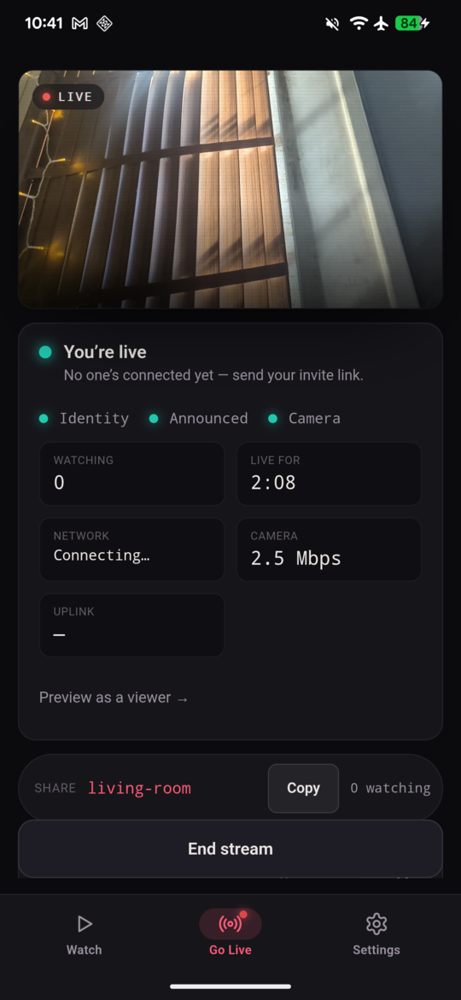
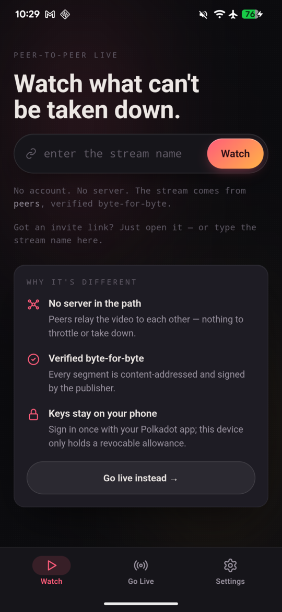
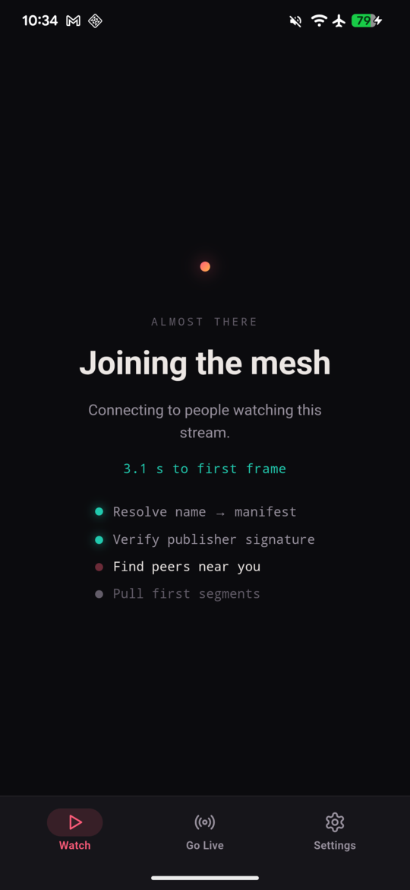
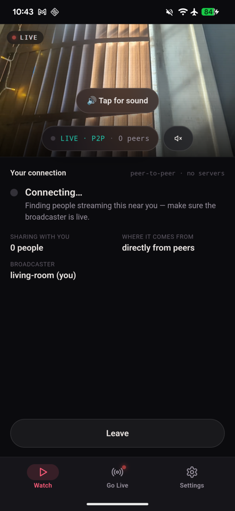
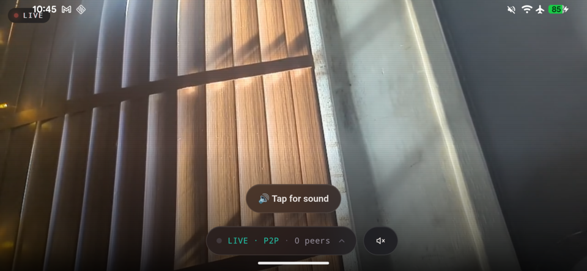

<div align="center">

# Unstation for Android

*Watch and broadcast live video peer-to-peer from your phone — no servers, no CDN, no account.*


[](https://github.com/lovelaced/unstation-android/actions/workflows/ci.yml)




</div>

---

Unstation for Android is the mobile companion to [Unstation](https://github.com/lovelaced/unstation-desktop). Point your camera at the game and go live — the video flows straight from your phone to your friends over a WebRTC mesh, with every segment cryptographically verified. Viewers find you through the Polkadot statement store; nothing is hosted and nothing can be taken down.

## Features

- **Go live from your camera** — hardware-encoded H.264 (Camera2 + MediaCodec) muxed on-device and served straight into the peer-to-peer mesh. Your broadcast survives switching apps: a foreground service keeps the camera rolling.
- **Watch anywhere** — live streams play through hls.js with the same byte-for-byte verification as desktop, plus tap-for-sound, skip-to-live, and rotate-for-fullscreen.
- **Invite links** — share `unstation://watch/<name>` (or a QR, or the Android share sheet); friends who open it land directly in your stream.
- **Honest connection states** — "joining the mesh", "catching up", "can't reach anyone", and "the broadcast ended" are real states driven by the engine, never a fake spinner.
- **Sign in once with your phone** — a same-device deep link to the Polkadot app grants this device a small, revocable network pass. Keys never leave the wallet.
- **One codebase with desktop** — the Rust mesh engine and web UI are shared with `unstation-desktop`; this repo adds only the Android shell, camera plugin, and mobile UX layer.

<div align="center">
  
  &nbsp;
  
  &nbsp;
  
</div>

<div align="center">
  
  <br><em>Rotate to go fullscreen — the video owns the whole screen.</em>
</div>

## Install

Grab the latest APK from [Releases](https://github.com/lovelaced/unstation-android/releases) and install it (you may need to allow installs from unknown sources), or build it yourself below.

To watch or broadcast you also need the Polkadot app on the same phone — Unstation signs you in with a one-tap handoff to it.

## Build from source

This repo **reuses the desktop app's Rust core and web frontend** rather than duplicating them:

- `src-tauri/` depends on `unstation-desktop/crates/unstation-app` (the shared Tauri command/event layer) via a path dependency, and that in turn depends on the private chain SDK — so **three repos must sit next to each other under the same parent directory**:

  ```
  ~/git/unstation-desktop     # the shared engine + frontend
  ~/git/unstation-android     # this repo
  ~/git/useragent-kit         # the private chain SDK (ask the maintainers for access)
  ```

- The frontend is single-sourced: `vite.config.js` points Vite's `root` at the desktop app's `src/` tree, so the UI is shared verbatim (no copies, no drift). Android-only behavior and styling are injected via the `ui/` shims.

<details>
<summary>Prerequisites</summary>

- Android SDK with **NDK r27+** (r28 recommended — it produces the 16 KB page-aligned libraries Android 15+ requires), the SDK's bundled **cmake + ninja**, and a JDK (17+)
- Rust (stable) with the Android targets: `rustup target add aarch64-linux-android`
- Node + pnpm

</details>

```sh
export ANDROID_HOME=<your-sdk>                       # e.g. ~/Library/Android/sdk
export NDK_HOME=$ANDROID_HOME/ndk/<r28-version>      # NDK_HOME specifically — Tauri reads it
export ANDROID_NDK_HOME=$NDK_HOME ANDROID_NDK_ROOT=$NDK_HOME
export JAVA_HOME=<your-jdk>
# The SDK's bundled cmake+ninja must win over any system cmake:
export PATH=$ANDROID_HOME/cmake/3.22.1/bin:$JAVA_HOME/bin:$ANDROID_HOME/platform-tools:$PATH

pnpm install
pnpm tauri android build --debug --target aarch64
adb install -r src-tauri/gen/android/app/build/outputs/apk/universal/debug/app-universal-debug.apk
adb shell am start -n io.parity.unstation.android/.MainActivity
```

> **⚠️ `gen/android` is hand-maintained — do NOT re-run `pnpm tauri android init`.**
> The generated tree is committed and carries real, non-regenerable code:
> `CameraPlugin.kt` / `CameraBridge.kt` (camera publish), `PublishForegroundService.kt`
> (backgrounded-broadcast survival), and `AndroidManifest.xml` entries (camera +
> foreground-service permissions, the service declaration, the `polkadotapp://`
> package-visibility query, the `unstation://` deep-link filter). A regen silently
> clobbers all of it. If a Tauri upgrade requires regenerating, diff the old tree
> back in by hand.

## How it works

The heavy lifting lives in [`unstation-desktop`](https://github.com/lovelaced/unstation-desktop) — the deadline-aware mesh engine, WebRTC transport, statement-store signaling, and verification pipeline. This repo adds the Android-specific layer:

1. **Camera → mesh** — `CameraPlugin.kt` drives Camera2 into a hardware H.264 encoder; encoded frames cross into Rust over JNI (no JSON bridge in the hot path), get muxed into CMAF fragments, and are served to peers exactly like a desktop broadcast.
2. **Playback** — Android's WebView has no native HLS, so the shared player is backed by hls.js, tuned to hold the live edge.
3. **Mobile shell** — a native bottom nav, hardware-back routing, keyboard-aware layout, keep-screen-on while live, and a typed camera foreground service so broadcasts survive backgrounding.

## Contributing

The shared engine and UI live in `unstation-desktop` — most changes belong there and arrive here for free. For Android-specific work: `ui/` holds the mobile shims (CSS/JS injected over the shared tree), `src-tauri/gen/android/.../io/parity/unstation/android/` the Kotlin. CI builds the frontend against the shared tree on every PR to catch drift.

## License

[AGPL-3.0-or-later](LICENSE), same as the desktop app whose code it embeds.
